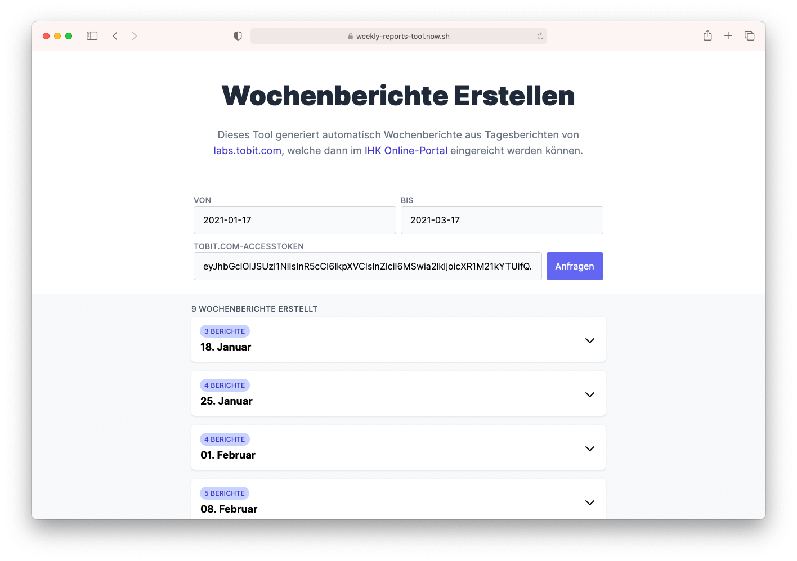

  

<h1 align="center">Reports</h1>

    <strong>Does weekly summarizations of daily reports from Tobit to  submit to the IHK.</strong>

  

At my previous employer, Tobit Software Laboratories AG, we wrote a report daily
to document our progress.

Also, while being an apprentice, we would have to submit a report to the IHK
each week, summarising what you have done that week.

So this tool saves me and my colleagues the tedious work of manually converting
the daily reports into weekly ones by automating the process.

 

## Screenshots

## Development

1. **Requirements**

   You should have an LTS version of [Node.js](https://nodejs.org/en/)
   installed.

2. **Install the dependencies**

   Run `npm install` to install all necessary packages.

3. **Run the application**

   Start the development server by running `npm run dev`.

 
