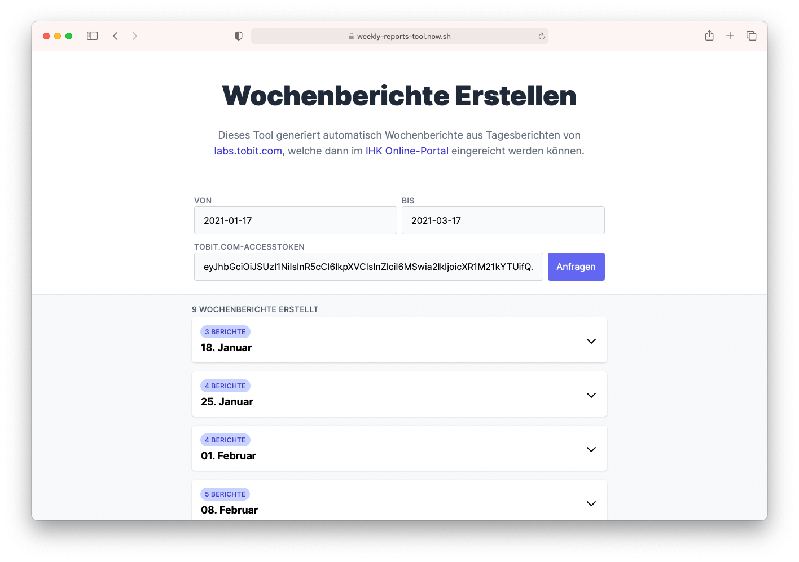

<h1 align="center">weekly-reports-tool</h1>

    <strong>Automates converting daily reports from Tobit into weekly ones to submit to the IHK.</strong>

 
    
    

    <a href="#-screenshots"><b>Screenshots</b></a>
      •  
    <a href="#-development"><b>Development</b></a>
      •  
    <a href="#-contribute"><b>Contribute</b></a>  

---

At Tobit Software Laboratories AG we write a daily report each day to summarise
our progress.

Also, while beeing an apprentice at the IHK, you have to submit a report to them
each week, summarising what you have done that week.

So this tool saves me and my colleagues the tedious work of manually converting
the daily reports into weekly ones by automating the process.

 

## ❯ Screenshots

 

## ❯ Development

1. **Requirements**

   You should have an LTS version of [Node.js](https://nodejs.org/en/) installed
   installed as well as [Yarn Classic](https://classic.yarnpkg.com/en/).

2. **Install the dependencies**

   Run `yarn install` to install all neccesary packages.

3. **Run the application**

   Start the development server by running `yarn dev`.

 

## ❯ Contribute

If you think you have any ideas that could benefit the project, feel free to
create a pull request!

 

---

    
        Project by Leo Driesch, released under <a href="https://github.com/leodr/weekly-reports-tool/blob/main/LICENSE">MIT license</a>.
    

    
    &nbsp;&nbsp;
    

